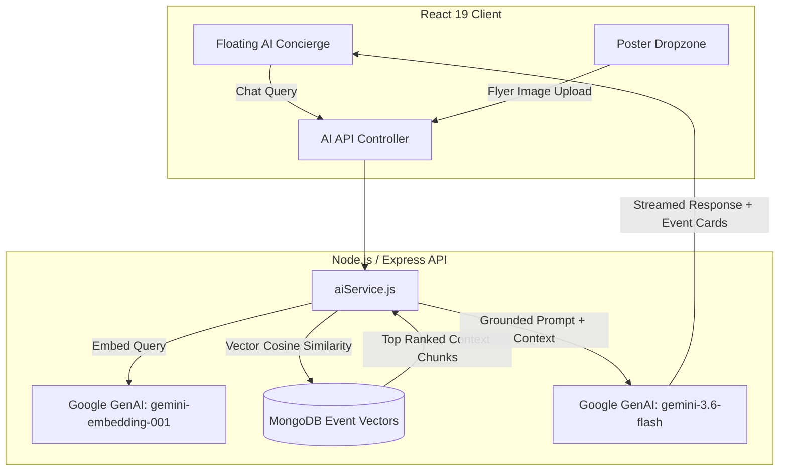

# 🎓 Eventro — AI-Powered Campus Event Management & Discovery Platform

[](https://react.dev/)
[](https://nodejs.org/)
[](https://expressjs.com/)
[](https://www.mongodb.com/)
[](https://aistudio.google.com/)
[](LICENSE)

**Eventro** is an enterprise-grade, full-stack campus event management and discovery platform. Designed for colleges, clubs, and universities, Eventro streamlines event coordination, automated ticket registration, and campus discovery through modern **Retrieval-Augmented Generation (RAG)** and **Multimodal Vision AI**.

---

## ✨ Cutting-Edge AI Features

### 1. 🤖 Campus RAG Event Concierge & Semantic Search
* **Natural Language Event Discovery:** Students chat naturally (*"Are there any free hackathons or coding contests this weekend?"* or *"What workshops offer certificates?"*).
* **True Vector Embeddings:** Events are embedded into 3,072-dimensional vector space using Google's `gemini-embedding-001`.
* **Cosine Similarity Ranking:** Queries are evaluated against event vectors using high-performance vector math with dynamic thresholding to eliminate irrelevant matches.
* **Grounded, Hallucination-Free Answers:** Powered by Google Gemini (`gemini-3.6-flash`), the concierge synthesizes conversational recommendations accompanied by **interactive, clickable Event Cards** with direct routing to event registration pages.

### 2. 🖼️ "Poster-to-Event" Multimodal AI Ingestion
* **1-Click Event Creation:** Organizers simply drag and drop promotional flyers or posters (Canva PNG/JPG).
* **Vision Information Extraction:** Gemini Vision extracts:
  * Official Event Title
  * Hosting College / Department
  * Event Date & Time (ISO formatted)
  * Category (*Tech, Cultural, Sports, Workshop, Seminar*)
  * Free / Paid status and Registration Fee
  * Rich Markdown Description & Highlights
* **Automatic Banner Preview:** Sets the uploaded flyer directly as the event's banner image without requiring a second upload.

---

## 🚀 Core Platform Capabilities

### 👨‍🎓 For Students
* **Smart Discovery Feed:** Discover trending campus events with real-time category filters and search.
* **Interactive Event Calendar:** Powered by `react-big-calendar` to track registration deadlines and clash-free schedules.
* **One-Click Event Registration:** Instant digital tickets, registration tracking, and PDF export via `html2pdf.js`.
* **Community Engagement:** Ask questions directly to event organizers and rate events with verified reviews.

### 🏛️ For Administrators & Club Coordinators
* **AI-Assisted Event Publisher:** Publish events in seconds using AI flyer scanning.
* **Real-time Analytics Dashboard:** Visual insights on registration count, popularity trends, and college engagement via `Chart.js`.
* **Attendee Management:** Monitor registrations, record attendance, track winners, and export verified registration data directly to CSV.
* **Multi-Tier Hierarchy:** Support for Colleges, Departments, and Student Clubs with dedicated dashboards.

### 👑 For Super Administrators
* **Multi-Tenant Administration:** Platform-wide oversight of colleges, student approvals, and system-wide broadcast announcements.

---

## 🛠️ Tech Stack

| Layer | Technologies |
| :--- | :--- |
| **Frontend** | React 19, React Router v7, Context API, Chart.js, React-Big-Calendar, Custom Aura Glass CSS, React Icons |
| **Backend** | Node.js, Express.js (REST API), Multer |
| **AI / ML** | Google Gemini 3.6 Flash (`@google/genai`), `gemini-embedding-001` (Dense Vector Embeddings) |
| **Database** | MongoDB & Mongoose ODM (Native Vector Embedding Schema) |
| **Media & CDN** | Cloudinary & Multer-Storage-Cloudinary |
| **Security** | JWT (Stateless Authentication), Bcrypt.js (Password Hashing), Role-Based Access Control (RBAC) |

---

## 🏗️ Architecture & Data Flow



---

## 📂 Project Structure

```text
eventro_dev/
├── backend/
│   ├── config/              # Database connection
│   ├── controllers/         # Request handling & logic (aiController, eventController, etc.)
│   ├── middleware/          # Auth guards, role verification, file upload middleware
│   ├── models/              # Mongoose schemas (Event, User, Club, Registration, etc.)
│   ├── routes/              # Express API route definitions
│   ├── services/            # Core AI Service (Gemini multimodal & vector search)
│   ├── server.js            # Server entry point & route mounting
│   └── package.json
│
├── frontend/
│   ├── public/              # Static assets, HTML shell, icons
│   ├── src/
│   │   ├── components/      # Reusable UI widgets (AiConcierge, EventForm, EventCard, Navbar)
│   │   ├── context/         # Global state (AuthContext)
│   │   ├── pages/           # Route views (Dashboard, Events, EventDetails, Analytics)
│   │   ├── styles/          # Aura Glass design system and global themes
│   │   ├── config.js        # Dynamic API base URL configuration
│   │   └── App.js           # Route hierarchy & global concierge mount
│   └── package.json
│
├── .gitignore               # Comprehensive Git ignore policy
└── README.md
```

---

## ⚙️ Installation & Local Setup

### Prerequisites
* **Node.js**: v18.0 or higher
* **MongoDB**: Local MongoDB instance (`mongodb://127.0.0.1:27017`) or MongoDB Atlas URI
* **Google Gemini API Key**: Free tier available at [Google AI Studio](https://aistudio.google.com/)
* **Cloudinary Account**: For permanent image storage

---

### 1. Clone the Repository
```bash
git clone https://github.com/sathwikpunna31-jpg/EventRo.git
cd EventRo
```

---

### 2. Backend Configuration & Setup

1. Navigate to the backend directory:
   ```bash
   cd backend
   npm install
   ```

2. Create your environment configuration:
   ```bash
   cp .env.example .env
   ```

3. Fill in your `.env` variables:
   ```env
   PORT=5000
   MONGO_URI=mongodb://127.0.0.1:27017/eventro
   JWT_SECRET=your_jwt_secret_key_here
   NODE_ENV=development

   # Cloudinary Configuration
   CLOUDINARY_CLOUD_NAME=your_cloudinary_cloud_name
   CLOUDINARY_API_KEY=your_cloudinary_api_key
   CLOUDINARY_API_SECRET=your_cloudinary_api_secret

   # Google Gemini AI Configuration
   GEMINI_API_KEY=your_gemini_api_key_here
   ```

4. Start the backend server:
   ```bash
   npm run dev
   ```
   *The server runs on `http://localhost:5000` by default.*

---

### 3. Frontend Configuration & Setup

1. Open a new terminal and navigate to the frontend directory:
   ```bash
   cd frontend
   npm install
   ```

2. Start the React development server:
   ```bash
   npm start
   ```
   *The application will launch in your browser at `http://localhost:3000`.*

---

## 📡 API Overview

| Method | Endpoint | Description | Access |
| :--- | :--- | :--- | :--- |
| `POST` | `/api/ai/parse-poster` | Extracts structured JSON event data from uploaded flyer | Private (Admin) |
| `POST` | `/api/ai/chat` | Conversational RAG assistant query endpoint | Public / Student |
| `POST` | `/api/ai/sync-embeddings` | Generates vector embeddings for existing events | Private (Admin) |
| `GET` | `/api/events` | Fetches filtered events by visibility and college | Public / Student |
| `POST` | `/api/events` | Creates a new event with automatic background embedding | Private (Admin) |
| `POST` | `/api/events/:id/register`| Registers student for an event | Private (Student) |
| `GET` | `/api/events/:id/registrations/csv` | Exports event attendee list as CSV | Private (Admin) |

---

## 🛡️ Security & Best Practices

* **Zero-Credential Git History:** Secrets are securely isolated in local environment variables and untracked from Git.
* **Role-Based Access Control (RBAC):** Frontend route guards (`AdminRoute`, `StudentRoute`, `SuperAdminRoute`) coupled with backend JWT claim validation.
* **Dynamic AI Grounding:** Prevents hallucinations by strictly confining LLM responses to verified retrieved database records.
* **Safe Fallbacks:** App operates gracefully without crashes even if the AI API key is temporarily unavailable.

---

## 🤝 Contributing

Contributions, issues, and feature requests are welcome! Feel free to check the [issues page](https://github.com/sathwikpunna31-jpg/EventRo/issues).

---

## 📄 License

This project is licensed under the **MIT License** — see the [LICENSE](LICENSE) file for details.
